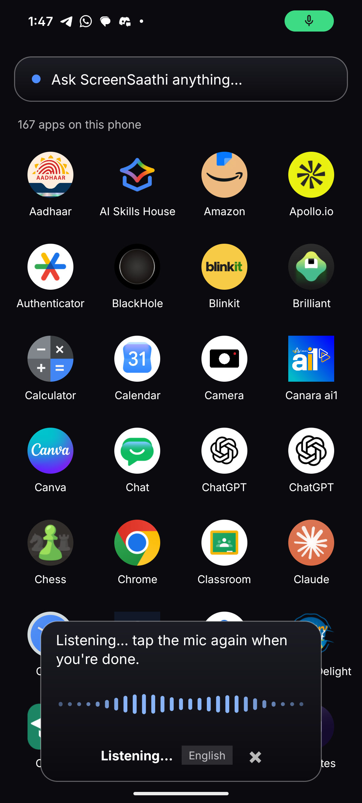
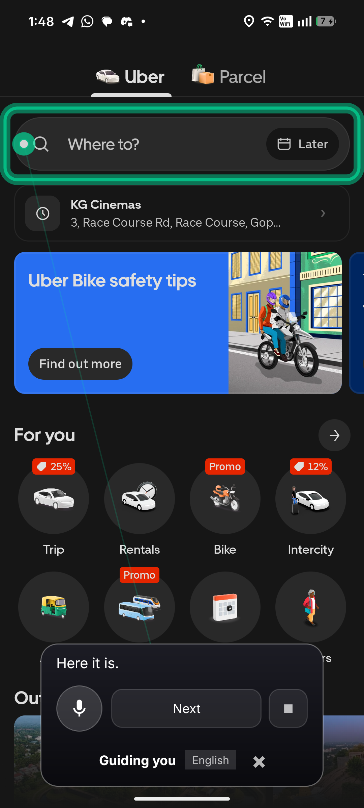
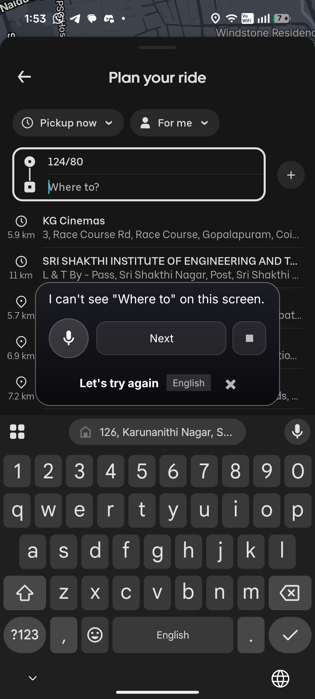
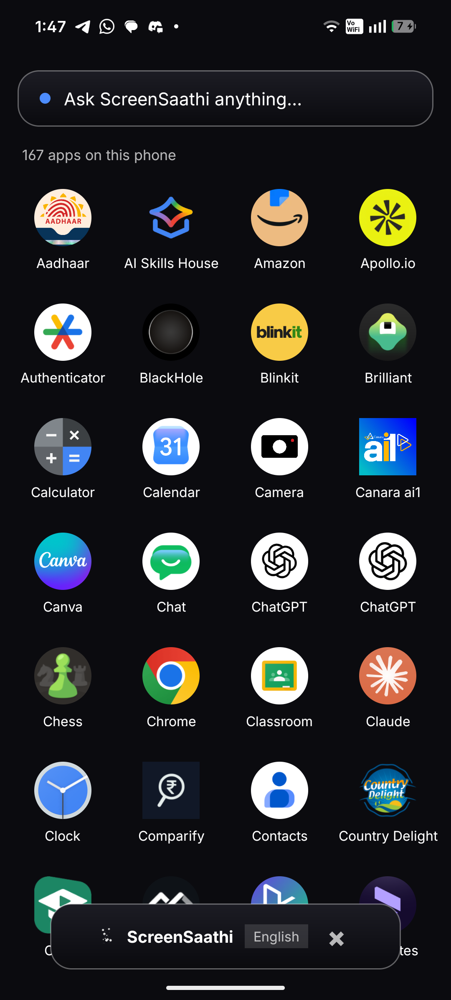
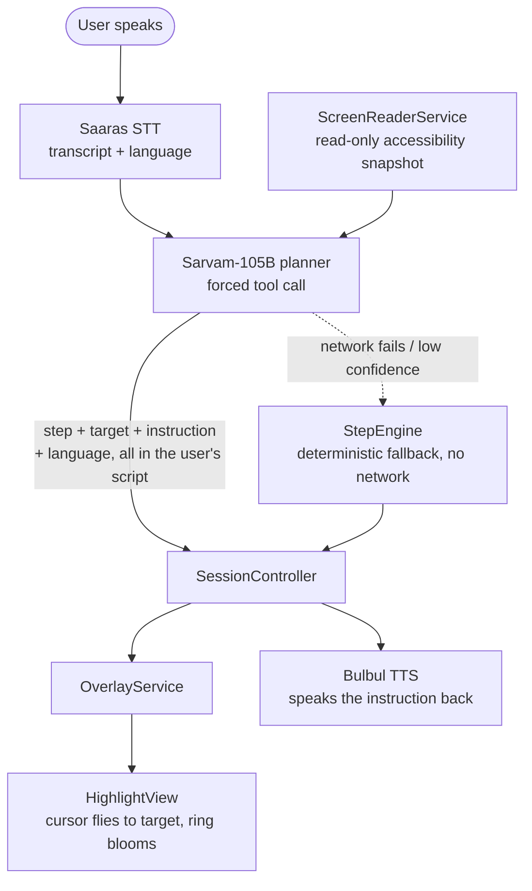

# ScreenSaathi

### An open-source AI copilot that sees your Android screen and shows you exactly where to tap


[](https://github.com/NITISH-R-G/ScreenSaathi/actions/workflows/android.yml)
[](LICENSE)
[](https://kotlinlang.org)
[](src/ScreenSaathi/app/build.gradle.kts)
[](https://github.com/NITISH-R-G/ScreenSaathi/releases/latest)

**[🌐 Website](https://nitish-r-g.github.io/ScreenSaathi/)** ·
**[📱 Download APK](https://github.com/NITISH-R-G/ScreenSaathi/releases/latest)** ·
**[🤝 Contribute](src/ScreenSaathi/CONTRIBUTING.md)** ·
**[🗺️ Roadmap](ROADMAP.md)**

No build required to try it — the APK is on the releases page. Jump to [Install](#install).

---

## The problem

Modern app interfaces assume a level of visual fluency a lot of people don't
have — small text, buried buttons, icons with no label, a "Where to?" field
that looks nothing like a form. Most voice assistants can't help here either:
they answer trivia or launch apps, but they don't know what's *actually on
your screen right now*.

## What ScreenSaathi does

ScreenSaathi listens to a spoken request, reads the **live UI through
Android's Accessibility API**, resolves the *actual* button or field you
need — not a hardcoded coordinate, not a guess — and draws a ring around it.
Then it waits for **you** to tap it. It never taps, types, or acts on your
behalf. It listens and answers in Hindi, Tamil, or English — whichever one
you spoke.

```
Voice  →  Intent (Sarvam STT + planner)  →  Screen perception (Accessibility API)
       →  Target resolution (ranked, app-agnostic)  →  Visual highlight
       →  User taps it themselves  →  Screen-change detected  →  re-perceive  →  repeat
```

## What it looks like

Real on-device screenshots, captured against the current app — not mockups.

### Voice



Tap the assistant, speak a request. The waveform is genuine mic RMS, not a
decorative animation — see `docs/DECISIONS.md` in the Android project for why
it's computed inside the existing recording loop instead of a second stream.

### Screen understanding → target highlighting



This is the core loop, shown in one real capture: ScreenSaathi read Uber's
live accessibility tree, ranked-matched the actual `Where to?` element (no
Uber-specific code — the same resolver runs against any app), and drew the
ring around it while speaking the instruction back. If the target isn't
genuinely visible, the resolver says so instead of guessing.

### Keyboard awareness



The overlay is `FLAG_NOT_FOCUSABLE`, so it can't see the keyboard through its
own `WindowInsets` — it reads the accessibility window list instead (the one
vantage point that can see every window on the display) and moves itself
clear automatically.

<details>
<summary>More real captures: idle state, and earlier cursor/multilingual footage</summary>

| | |
|---|---|
|  | |

| | |
|---|---|
|  |  |
| Cursor arrives, ring blooms, instruction spoken | It *travels* between fields |
|  |  |
| Detected Hindi → asked in Hindi → real installed apps | Same flow, detected Tamil → asked in Tamil |

</details>

**Not shown, and not faked:** a "thinking" state (too transient — under a
second — to reduce to a static image) and a drag-in-progress capture
(inherently a motion, not a moment). Both behaviors are real; they just don't
make an honest screenshot. See the Android project's `docs/DEMO.md` for the
full verified flows.

## How it's built



| Piece | Job |
| --- | --- |
| **Overlay pill** | Renders the highlight and pill. Never reasons. |
| **Screen reader** | Read-only Accessibility snapshot of the live UI. No gestures. |
| **Saaras STT** | Voice → transcript + detected language. |
| **Sarvam-105B planner** | Transcript + screen snapshot → next step, forced tool call. |
| **Bulbul TTS** | Instruction → spoken audio, in the detected language. |
| **StepEngine** | Deterministic, no-network fallback — completes the task even if every network call above fails. |

This is the M1-milestone shape, frozen by design (see
[Contracts](#contracts)). Real subsystems added since — target resolution,
the movable/keyboard-aware overlay, the voice waveform — are documented in
the current source of truth: `docs/ARCHITECTURE.md`. The reasoning behind
the less-obvious choices (why `flagIncludeNotImportantViews`, why
`TYPE_WINDOW_STATE_CHANGED` and not `TYPE_VIEW_CLICKED`, why a fixed-geometry
overlay window) is in `docs/DECISIONS.md` — read it before touching any of
the pieces above.

### Contracts

Everything in the table above is written against four frozen JSON Schemas in
`src/ScreenSaathi/contracts/`: `planner`, `task`, `accessibility`, `overlay`.
No field is ever removed after M1 — only optional fields may be added. Tasks
themselves are pure data (`src/ScreenSaathi/app/src/main/assets/tasks/*.json`)
— adding one is dropping a JSON file, not writing code.

## Project structure

The Android app lives at **[`src/ScreenSaathi/`](src/ScreenSaathi/)** —
that's the actual Gradle project: open that folder in Android Studio, or
`cd` into it before running any Gradle command below.

```
ScreenSaathi/
├── README.md              ← you are here (project landing page)
├── ROADMAP.md              shipped / in progress / planned
├── LICENSE, SECURITY.md, CODE_OF_CONDUCT.md
├── .github/                CI workflow, issue + PR templates
└── src/ScreenSaathi/       ← the actual Android Studio project
    ├── app/                 Kotlin source, resources, unit tests
    ├── contracts/           frozen JSON Schemas (planner, task, accessibility, overlay)
    ├── docs/                architecture, decisions, dev setup, demo flows, troubleshooting
    ├── docs/assets/         the screenshots used above
    ├── AGENTS.md            entry point for an AI coding agent picking this up
    ├── CONTRIBUTING.md      setup, workflow, "good first contribution" by area
    └── README.md            the full technical README (build details, data handling, limitations)
```

Everything below in this file is the quick-start version. For build
internals, the demo flows, and the full "honest limitations" list, see
[`src/ScreenSaathi/README.md`](src/ScreenSaathi/README.md).

## Install

**Fastest path — no build required:**

1. **[Download the latest APK](https://github.com/NITISH-R-G/ScreenSaathi/releases/latest)** and install it (allow "install from unknown sources" if prompted).
2. Open ScreenSaathi and grant, in order: **Display over other apps** → **Microphone** → **Accessibility service**.
3. Tap **Start assistant**, go to the home screen, tap the floating pill, and speak a request — e.g. *"Help me book a taxi."*

A **physical Android device (8.0+)** is required — accessibility services,
overlay windows, and the microphone don't behave meaningfully on an emulator.

**Building from source instead?**

```powershell
cd src/ScreenSaathi
cp local.properties.example local.properties   # set sdk.dir; sarvam.api.key is optional
.\gradlew.bat assembleDebug
```

The app builds and runs with **no Sarvam key** — every network step falls
back to the deterministic `StepEngine`. Full walkthrough:
[`src/ScreenSaathi/docs/DEVELOPMENT.md`](src/ScreenSaathi/docs/DEVELOPMENT.md).

## Contribute

Bug reports, PRs, and questions are welcome.
[`src/ScreenSaathi/CONTRIBUTING.md`](src/ScreenSaathi/CONTRIBUTING.md) has a
**"Good first contribution"** section broken down by area — AI/agent,
Android, vision/perception, UX, safety, and developer experience — plus setup
and workflow. If you're an AI coding agent picking this repository up, start
at [`src/ScreenSaathi/AGENTS.md`](src/ScreenSaathi/AGENTS.md).

Five core pieces (overlay, screen reader, Saaras STT, Bulbul TTS, the
planner) and the JSON Schema contracts are frozen — see Contracts above.
Everything else — prompt/planner improvements, UX polish, reliability,
performance, new tasks — is fair game without asking first.

## Roadmap

See **[`ROADMAP.md`](ROADMAP.md)** for the full Shipped / In Progress /
Planned breakdown. Short version: the core voice → perceive → resolve →
highlight loop, three-language support, and the deterministic offline
fallback are shipped and verified on-device; planner latency and broader
third-party app coverage are in progress; an AI-provider abstraction and a
vision fallback for apps that expose little to accessibility are planned but
deliberately not started yet (see `docs/DECISIONS.md` for why).

## Release

The latest APK, its SHA256 checksum, and install notes are on the
[Releases page](https://github.com/NITISH-R-G/ScreenSaathi/releases/latest).
Release process and how a new build is verified before shipping:
[`src/ScreenSaathi/docs/DEVELOPMENT.md`](src/ScreenSaathi/docs/DEVELOPMENT.md#release-process).

## Data handling & security

ScreenSaathi sends a text snapshot of the foreground app's screen, plus
recorded audio and spoken instructions, to `api.sarvam.ai` to do its job. No
screen content, transcript, or audio is persisted beyond a temporary `.wav`
file deleted immediately after each call. Full accounting:
[`src/ScreenSaathi/SECURITY.md`](src/ScreenSaathi/SECURITY.md) and
[`src/ScreenSaathi/docs/DATA_HANDLING.md`](src/ScreenSaathi/docs/DATA_HANDLING.md).

## License

[MIT](LICENSE).

---

Built for **Tech for Good 2026**, GDG Coimbatore / Build with AI: Code for
Communities.
