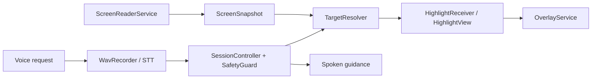

# SCREENSAATHI

> **Voice-controlled accessibility layer for Android that understands the live screen and guides users to exactly what they need to tap.**

ScreenSaathi is an Android accessibility prototype for people who need spoken, contextual help navigating app interfaces. It listens to a request, reads the visible accessibility tree, resolves the relevant on-screen control, and places a precise visual highlight with a spoken instruction. It guides; it does not automate taps or payments.

## Quick demo

1. Install the debug APK.
2. Enable **ScreenSaathi screen reader** under Android Accessibility.
3. Grant microphone and display-over-other-apps permissions.
4. Start ScreenSaathi and say: **“Help me book a taxi.”**
5. Open Uber when prompted; ScreenSaathi identifies and highlights **“Where to?”**.
6. Tap the target. ScreenSaathi invalidates the old highlight and perceives the new screen.

If Accessibility is disabled after reinstall, Android may have turned the service off. Open **Settings → Accessibility → ScreenSaathi → Enable**.

## What it does

- Reads the live accessibility tree with `ScreenReaderService` and creates a `ScreenSnapshot`.
- Uses `TargetResolver` to locate a requested visible control, then highlights its exact bounds.
- Provides voice capture, a listening waveform, spoken guidance, and deterministic fallbacks.
- Keeps the floating assistant movable, collapsible, keyboard-aware, and stable across screen transitions.

## Problem and solution

Complex mobile interfaces make an otherwise simple task difficult when a person cannot easily find the next field or button. ScreenSaathi turns a spoken goal into a grounded, on-screen cue: it sees the current UI, chooses a target only when it is visible, and points to that target instead of attempting hidden automation.

## Key innovation

The assistant is grounded in the current screen rather than a static task script. A session controller coordinates screen perception, target resolution, safety checks, and an overlay that prevents stale highlights after transitions. The user remains in control of every tap.

## Architecture



## Screenshots

These are real on-device captures from the included prototype.

| Precise target highlight | Moving cursor between fields |
| --- | --- |
|  |  |
| Hindi app choice | Tamil guidance |
|  |  |

The repository does not include a captured PhonePe or keyboard-avoidance screenshot; those behaviors are represented by the shipped implementation, not fabricated artwork.

## Features

- Live screen perception and text/semantic target resolution
- Precise, transition-safe highlights
- Voice interaction with microphone recording and waveform feedback
- Movable and collapsible floating assistant with drag protection
- Keyboard-aware placement and fixed overlay geometry
- Safety guards for unsupported or ungrounded actions
- Launcher, Uber-oriented taxi flow, and demo resources/layouts/drawables

## Build

This is a Gradle Android project located at [`src/ScreenSaathi`](src/ScreenSaathi). Prerequisites: Android Studio (or Android SDK), JDK 11+, and an installed Android SDK matching the project configuration.

```powershell
cd src/ScreenSaathi
.\gradlew.bat assembleDebug
```

The repository includes the Gradle wrapper, wrapper JAR, Gradle configuration, manifest, source, and resources. `local.properties` is intentionally ignored. Copy `local.properties.example` to `local.properties` and set your SDK path if Android Studio has not already created it.

## Install APK

After a successful build, install [`app-debug.apk`](src/ScreenSaathi/app/build/outputs/apk/debug/app-debug.apk) using Android Studio or:

```powershell
adb install -r src/ScreenSaathi/app/build/outputs/apk/debug/app-debug.apk
```

The APK is generated locally and intentionally not committed.

## Required permissions

- Accessibility service: read the visible UI and resolve the target
- Display over other apps: render the assistant and highlight
- Microphone: capture a voice request

## Demo instructions

Use the launcher/rehearsal flow when a live microphone is impractical, or open a supported ride app and request taxi help. Verify that the assistant is visible, tap once to listen, then confirm the waveform appears. For the Uber flow, verify the precise **“Where to?”** highlight before tapping. Drag the assistant briefly to confirm dragging does not start recording.

## Known Android behavior and limitations

- Android can disable an accessibility service after reinstall; enable it again in Settings.
- Third-party app labels can change, which can invalidate text-based matching.
- The app guides a user to targets; it does not tap, type, complete payments, or persist a session.
- Network-backed speech/planning has deterministic fallback paths but live service availability can affect response time.

## Tech stack

Kotlin, Android SDK, AccessibilityService, Android overlay windows, Gradle, Sarvam STT/TTS/planning integrations, and JUnit tests.

## Team

**ScreenSaathi** — Tech for Good 2026, GDG Coimbatore / Build with AI: Code for Communities.

See the Android project’s [detailed technical README](src/ScreenSaathi/README.md), [data-handling notes](src/ScreenSaathi/docs/DATA_HANDLING.md), and [security notes](src/ScreenSaathi/SECURITY.md) for implementation detail.
