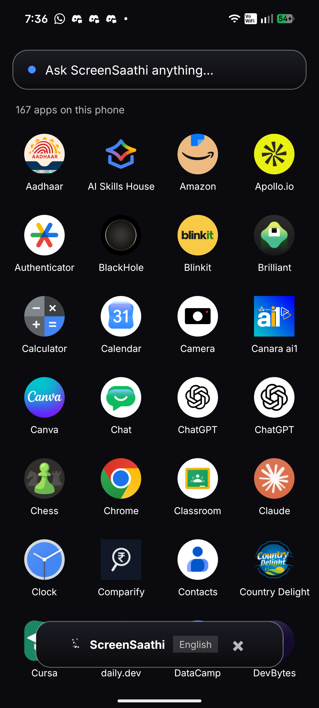
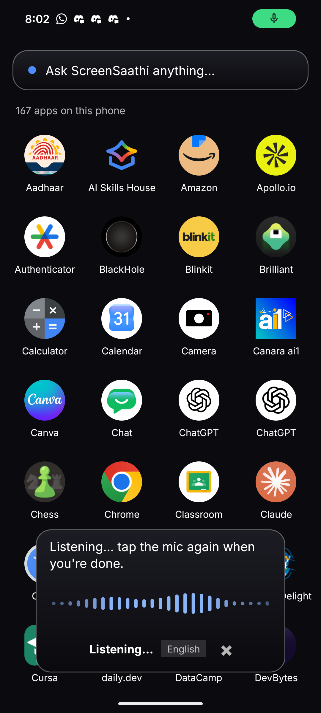
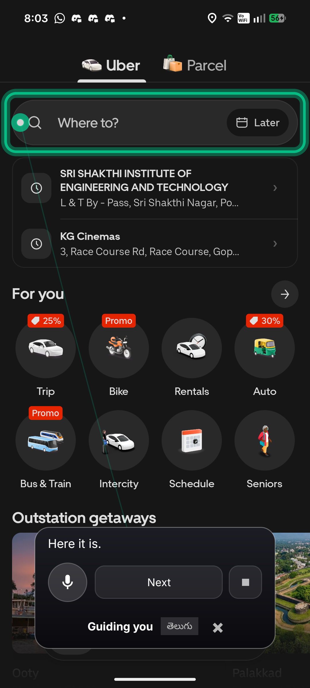
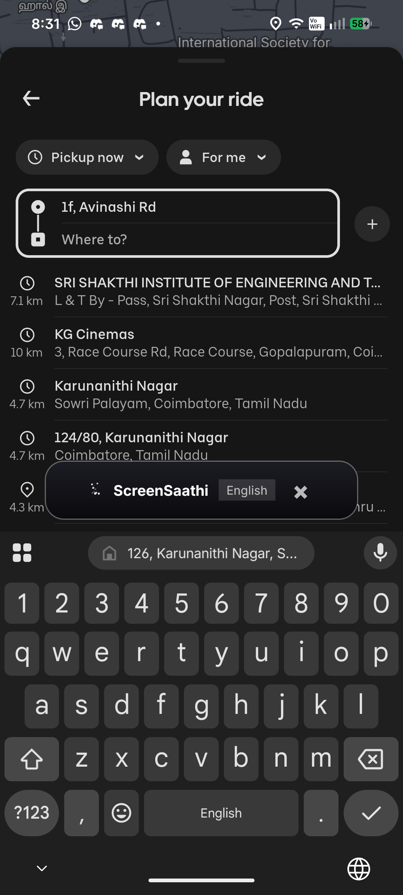
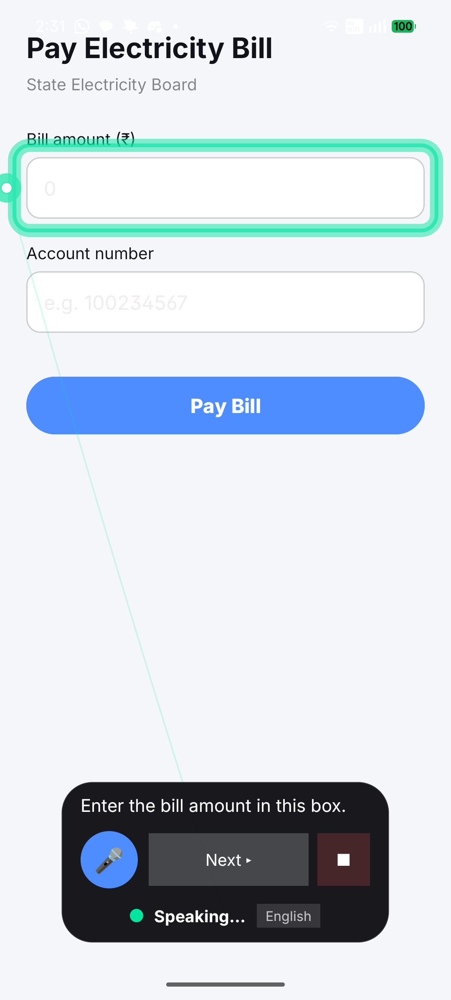
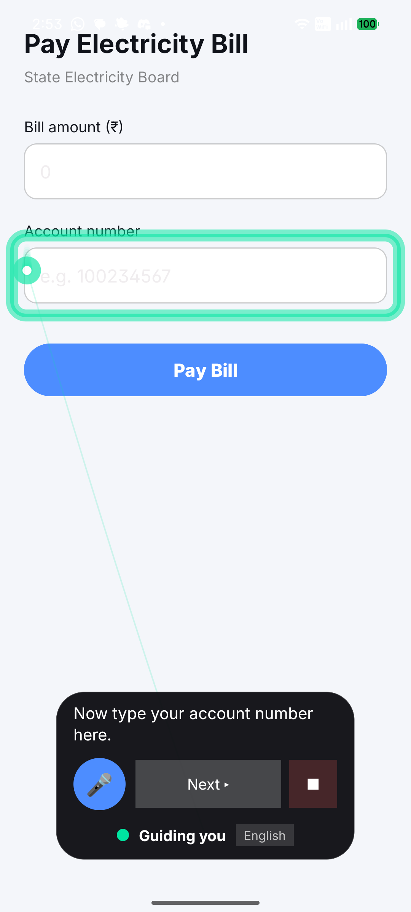
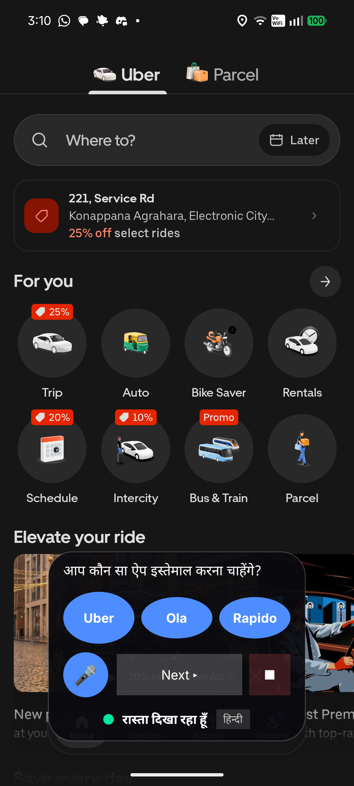
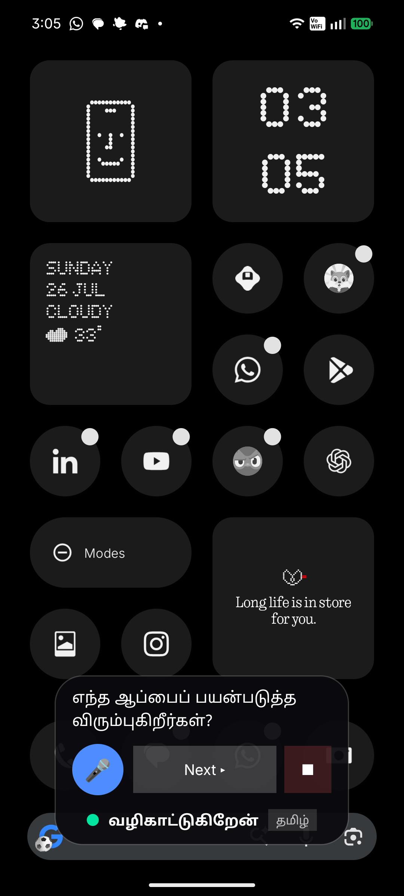
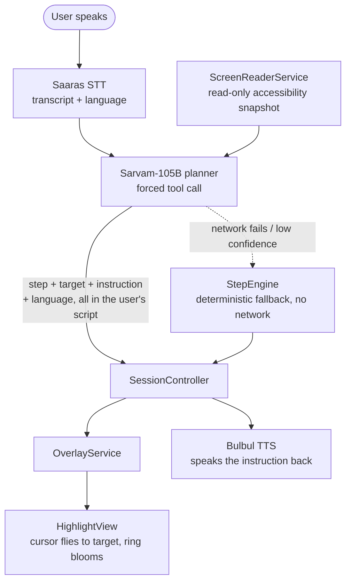

# ScreenSaathi

### An open-source AI copilot that sees your Android screen and shows you exactly where to tap

[](https://github.com/NITISH-R-G/ScreenSaathi/actions/workflows/android.yml)
[](LICENSE)
[](https://kotlinlang.org)
[](app/build.gradle.kts)
[](https://github.com/NITISH-R-G/ScreenSaathi/releases/latest)

Most voice assistants answer questions or launch apps. ScreenSaathi reads the
**live UI through Android's Accessibility API**, resolves the *actual* button
or field you need — not a hardcoded coordinate — and draws a ring around it.
Then it waits for **you** to tap it. It never acts on your behalf.

Built for people who find modern app interfaces hard to navigate: it listens
in Hindi, Tamil or English, and answers back in whichever one you spoke.

**[⬇ Download the demo APK](https://github.com/NITISH-R-G/ScreenSaathi/releases/latest)** — no build required, see [Installation](#installation) below.

## What it looks like

Real on-device screenshots, not mockups.

| | |
|---|---|
|  |  |
| Idle — compact, out of the way | Listening — one real waveform, driven by actual mic amplitude |
|  |  |
| The ring on Uber's real `Where to?` element — resolved, not hardcoded | Moves itself clear of the keyboard automatically |

<details>
<summary>More: the cursor animation and multilingual app choice</summary>

| | |
|---|---|
|  |  |
| Cursor arrives, ring blooms, instruction spoken | It *travels* between fields |
|  |  |
| Detected Hindi → asked in Hindi → real installed apps | Same flow, detected Tamil → asked in Tamil |

</details>

## How it works

```
Voice  →  Intent (Sarvam STT + planner)  →  Screen perception (Accessibility API)
       →  Target resolution (ranked, app-agnostic)  →  Visual highlight
       →  User taps it themselves  →  Screen-change detected  →  re-perceive  →  repeat
```

Full breakdown: [`docs/ARCHITECTURE.md`](docs/ARCHITECTURE.md). The *why*
behind the less obvious choices: [`docs/DECISIONS.md`](docs/DECISIONS.md).

Built solo in a single hackathon push — see [Honest limitations](#honest-limitations-read-this-before-you-get-excited)
before you assume more than what's demonstrated above.

## Architecture



Five pieces, and only five — this is a deliberate freeze, not an oversight:

| Piece | File | Job |
| --- | --- | --- |
| Overlay pill | `OverlayService.kt`, `overlay/HighlightView.kt` | Renders an `OverlayCommand`. Never reasons. |
| Screen reader | `ScreenReaderService.kt`, `screen/ScreenSnapshot.kt` | Read-only accessibility snapshot. No gestures. |
| Saaras STT | `sarvam/SarvamStt.kt`, `sarvam/WavRecorder.kt` | 16 kHz mono WAV → transcript + language. |
| Sarvam-105B planner | `sarvam/SarvamPlanner.kt` | Forced tool call → the frozen planner contract. |
| Bulbul TTS | `sarvam/SarvamTts.kt`, `sarvam/AudioPlayer.kt` | Instruction → warm spoken audio (`anand`). |

`session/SessionController.kt` orchestrates them. `session/StepEngine.kt` is the
deterministic core that completes the task with **no network at all** — every
one of the four network calls above can fail and the app still finishes the
task in scripted order.

This diagram is the **M1 milestone** shape — frozen at the time, no field ever
removed from a contract in `contracts/`. Real subsystems added since (target
resolution, the movable/keyboard-aware overlay, the voice waveform, the
launcher) are documented in [`docs/ARCHITECTURE.md`](docs/ARCHITECTURE.md),
the current source of truth. See `docs/PARKING_LOT.md` for what's still
deliberately deferred, and `CONTRIBUTING.md` before proposing anything that
touches a core piece.

## Installation

**Fastest path — no build required:**

1. **[Download the latest APK](https://github.com/NITISH-R-G/ScreenSaathi/releases/latest)** and install it (allow "install from unknown sources").
2. Open ScreenSaathi and grant, in order: **Microphone** → **Display over other apps** → **Accessibility service**.
3. Tap **Start assistant**, go to the home screen, tap the floating pill, and speak a request — e.g. *"Help me book a taxi."*

A **physical Android device (8.0+)** is required — accessibility services,
overlay windows and the microphone don't behave meaningfully on an emulator.

**Building from source instead?** See [Build](#build) below, or the full
walkthrough in [`docs/DEVELOPMENT.md`](docs/DEVELOPMENT.md).

## Build

Create `local.properties` in the project root (it is gitignored):

```properties
sdk.dir=C\:/path/to/Android/Sdk
sarvam.api.key=sk_your_key_here
```

The key is read into `BuildConfig.SARVAM_API_KEY` at build time, so no key is
ever hardcoded in a source file. **Without a key the app still runs** — every
network step falls back to the deterministic `StepEngine`, which is what the
offline demo path uses.

```bash
./gradlew assembleDebug
./gradlew testDebugUnitTest
```

## Contracts (frozen at M1)

`contracts/` holds the four JSON Schemas that everything else is written
against: `planner`, `task`, `accessibility`, `overlay`. No field is ever
removed after M1 — only optional fields may be added.

Tasks are pure data: `app/src/main/assets/tasks/*.json`. Two exist today —
`pay_bill` (the original demo screen, resource-id driven) and `book_taxi`
(a real installed ride app, matched by visible text since third-party view
ids are obfuscated — see `task/RideApps.kt`). Adding a task is dropping a
JSON file here, not writing code.

## Running the demo

1. Launch the app, grant **display over other apps**, **microphone**, and
   enable the **ScreenSaathi screen reader** in Accessibility settings.
2. Tap **Start** — the pill appears at the bottom edge.
3. Open the demo task screen, or tap one of the **rehearsal buttons**
   (`Taxi EN` / `टैक्सी HI` / `டாக்ஸி TA`) to drive the taxi flow without
   speaking — useful when a room is too loud to trust a microphone.
4. Tap the pill to expand, tap the mic, say what you want to do, tap the mic
   again. The cursor flies to the field; the instruction is spoken back in the
   language you spoke.

Long-press the pill to reveal the debug panel (transcript, intent, step,
target, latency, confidence, detected language). Keep it hidden during a real
demo.

> **Demo-day landmine:** `adb install` or force-stop silently unbinds the
> accessibility service. The app keeps working but the highlight stops
> resolving. After any reinstall, toggle the screen reader off and on in
> Settings. See `docs/PARKING_LOT.md`.

## Data handling

`ScreenReaderService` reads the on-screen content of whatever app is in the
foreground and sends a text snapshot of it, plus recorded audio and spoken
instructions, to `api.sarvam.ai`. No screen content, transcript, or audio is
persisted beyond a temporary `.wav` file deleted immediately after each call.
Full accounting: [`SECURITY.md`](SECURITY.md) and
[`docs/DATA_HANDLING.md`](docs/DATA_HANDLING.md).

## Honest limitations (read this before you get excited)

This was built solo in a single push and has real, known gaps — recorded here
rather than discovered by you later:

- **It narrates, it doesn't automate.** The user still types the amount,
  still types the destination — this points and reads aloud, it does not
  fill in a field for you.
- **Planner and TTS latency are both over their own stated budgets**
  (planner 867–1481 ms against a 700 ms target, TTS 909–1462 ms against
  900 ms) — see `docs/PARKING_LOT.md` for the numbers and why the visual
  cursor lands before speech regardless.
- **Hindi "skip ahead" phrasing is a known, logged bug** — being fixed in a
  separate PR alongside this one; see the linked issue if it's still open
  when you're reading this.
- **Third-party app guidance (Uber/Ola/Rapido) matches on hardcoded visible
  text**, not a resource id — it will need updating if those apps change
  their copy. There is no fallback matching strategy yet.
- **No session persistence.** Closing the app loses your place; resuming
  after `Stop` only works within the same process lifetime.
- **This has not yet been driven end-to-end by a real recorded human voice**
  through the phone microphone in every language it claims to support — Saaras
  STT, the planner, and Bulbul TTS are each verified live against the real
  Sarvam API individually (`scripts/smoke_*.ps1`), and the full pipeline is
  verified via the on-device rehearsal buttons, but a live microphone run in
  Tamil specifically is still open. Don't take "multilingual" further than
  that until it is.
